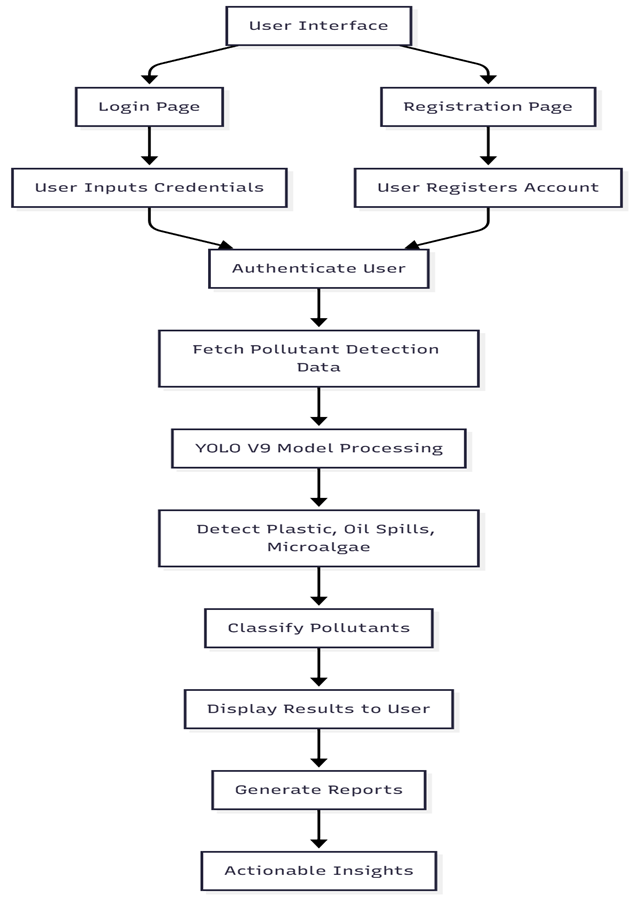
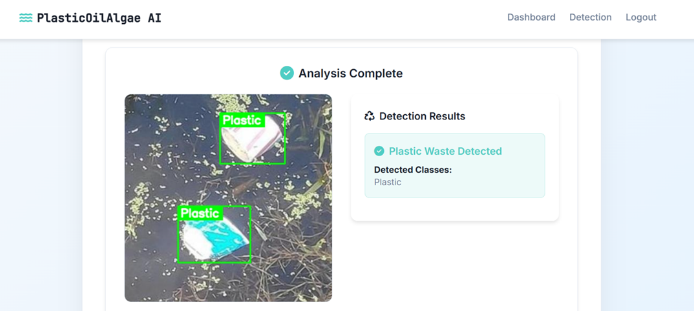

# 🚀 AI-Based Detection of Plastic Waste, Oil Spills and Microalgae Using YOLO

<p align="center">


</p>

---

# 📖 Overview

This project is an **AI-powered marine pollution monitoring system** that detects **Plastic Waste**, **Oil Spills**, and **Microalgae** from underwater images using the **YOLOv11 object detection model**.

The system provides a modern web interface where users can upload underwater images, select the pollutant category, receive AI-powered detections, and visualize bounding boxes around detected objects.

Additionally, the application includes a **voice assistant** that allows users to interact with the system using voice commands, improving accessibility and user experience.

---

# ✨ Features

- 🤖 AI-powered marine pollutant detection
- 🌊 Plastic Waste Detection
- 🛢 Oil Spill Detection
- 🌿 Microalgae Detection
- 📷 Image Upload Interface
- 📦 YOLOv11,YOLOv9 Object Detection
- 🟩 Bounding Box Visualization
- 📊 Detection Confidence Scores
- 🌐 Interactive Flask Web Application
- 👤 User Authentication (Login & Registration)
- 💾 SQLite Database Integration
- 📱 Responsive User Interface

---
# 🧠 Models Used

- YOLOv8s
- YOLOv9s
- YOLOv11s
---
# 🏆 Best Model Performance

| Detection Category | Model | Best Accuracy |
|-------------------|--------|---------------|
| Plastic Waste | YOLOv11 | **99.5%** |
| Oil Spill | YOLOv11 | **99.3%** |
| Microalgae | YOLOv11 | **98.6%** |

> These represent the **best-performing trained models** used in this project.

---

# 🏗 System Architecture

<p align="center">



</p>

---

# 📸 Application Screenshots

## 🧴 Plastic Waste Detection

<p align="center">



</p>

---

## 🛢 Oil Spill Detection

<p align="center">


</p>

---

## 🌿 Microalgae Detection

<p align="center">


</p>

---

# ⚙ Technology Stack

## Programming Language

- Python

## Backend

- Flask

## Frontend

- HTML5
- CSS3
- JavaScript
- Bootstrap

## Deep Learning

- YOLOv11
- PyTorch
- OpenCV

## Database

- SQLite

## Tools

- VS Code
- Jupyter Notebook
- Git
- GitHub

---

# 📂 Project Structure

```text
AI-Plastic-Oil-Microalgae-Detection
│
├── CODE
│   ├── BACKEND
│   │   ├── MODEL.ipynb
│   │   ├── Ocean-Plastics-Waste-Detection
│   │   ├── oil-spill-area
│   │   ├── super_algae
│   │   └── runs
│   │
│   └── FRONTEND
│       ├── static
│       ├── templates
│       ├── app.py
│       ├── db.sql
│       └── test.py
│
├── assets
│   ├── architecture.png
│   ├── home.png
│   ├── plastic_detection.png
│   ├── oil_spill_detection.png
│   └── microalgae_detection.png
│
├── README.md
└── .gitignore
```

---

# 🚀 Installation

## Clone the Repository

```bash
git clone https://github.com/sreejamukkara/AI-Plastic-Oil-Microalgae-Detection.git
```

## Navigate to the Project

```bash
cd AI-Plastic-Oil-Microalgae-Detection
```

## Install Dependencies

```bash
pip install -r requirements.txt
```

## Run the Application

```bash
cd CODE/FRONTEND

python app.py
```

Open your browser and visit:

```
http://127.0.0.1:5000
```

---

# 📊 Example Workflow

1. Login to the application.
2. Select the pollutant category.
3. Upload an underwater image.
4. The YOLOv11 model analyzes the image.
5. Detected objects are highlighted with bounding boxes.
6. Detection confidence is displayed.
7. Voice assistant can guide users during interaction.

---

# 🚀 Future Enhancements

- Real-time underwater video detection
- Drone and ROV integration
- Mobile application support
- Cloud deployment
- Marine pollution analytics dashboard
- Multi-language voice assistant
- Automatic pollution severity estimation
- GIS-based pollution mapping

---

# 👩‍💻 Author

**Mukkara Sreeja**

B.Tech Computer Science Engineering

### Areas of Interest

- Artificial Intelligence
- Deep Learning
- Computer Vision
- Marine Pollution Monitoring
- Object Detection
- Full Stack Development

GitHub:

https://github.com/sreejamukkara

---

# 📄 License

This project is licensed under the MIT License.

---

⭐ If you found this project useful, please consider giving it a **Star ⭐** on GitHub.
